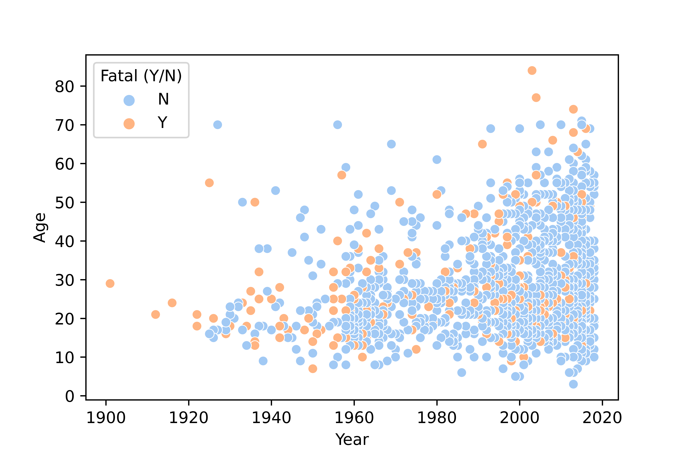

# Project_1

## SHARK ATTACK! What's up with that? 

# Section 1: Data Exploration 



```python
print('hello world')
```

hello there
 - bullet point
 

 # Section 2: Clean & Analyse 


 # Section 3: Data Visualisation & Conclusion